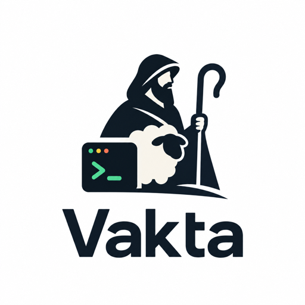

<p align="center">
  
</p>

# Vakta

Vakta is a native macOS terminal designed with one specific job: managing
**herdr** (and tmux) multiplexer sessions alongside a visual sidebar. It handles
terminal rendering via **libghostty** (using the prebuilt Swift package
[`Lakr233/libghostty-spm`](https://github.com/Lakr233/libghostty-spm)).

> **Status:** Early but functional — a real macOS `.app` with tagged
> [DMG releases](https://github.com/phin-tech/vakta/releases). Builds aren't
> code-signed or notarized yet, so a downloaded release is Gatekeeper-quarantined
> (see [Releasing](#releasing) to de-quarantine, or to enable signing).

## Core Features

- **Visual Session Switching** — Seamlessly switch between multiplexer sessions
  using the native sidebar or keyboard shortcuts (`Ctrl+Shift+1…9`, rebindable).
- **Session Profiles** — Launch sessions from data-driven profiles, with
  built-in defaults for herdr, tmux, and a standard login shell. Profiles carry
  free-form arguments (with `{name}` substituted for the session), so remote
  sessions are just `--remote me@host --session {name}`. Edit them in a modal.
- **Smart Environment Scrubbing** — Vakta prevents recursive multiplexer nesting
  by scrubbing `HERDR_*` / `TMUX` variables from the spawned child (via an
  `env -u …` prefix), so it never has to mutate its own environment.
- **Continuous Persistence** — Reattaches to still-running server sessions on
  launch rather than restoring dead terminal views. Profiles and workspace state
  are saved in `~/Library/Application Support/Vakta/`.
- **Stable Rendering** — Terminal views are hosted in a plain AppKit `NSView`
  rather than a SwiftUI container, so SwiftUI state diffs can't accidentally tear
  down and kill live terminal surfaces.

## Architecture

- **Terminal Core** — Pinned to `libghostty-spm` (tag `1.6.20260909`). We use
  the prebuilt XCFramework binary rather than building Zig from source.
- **Process Model** — One shared `TerminalController` per app process, handed to
  individual `Session` instances that manage their own terminal surfaces.
- **PTY Ownership** — libghostty completely owns the PTY and child-process
  spawning (using backend `.exec`).
- **Input Routing** — Session-switching shortcuts bypass the terminal via a local
  `NSEvent` monitor (`.keyDown`). All other keystrokes fall through directly to
  libghostty for flawless terminal passthrough (`keybind = clear`).

## Building and Running

Because libghostty renders with Metal, Vakta must run in a real macOS UI
session. It will crash if launched completely headlessly (e.g. over SSH with no
console user), because the Metal rendering context requires a display.

### Quick start (SPM)

For quick iteration, build and run via Swift Package Manager:

```sh
swift build
swift run Vakta
```

If you don't have herdr installed locally and just want to test the UI, force a
standard shell:

```sh
VAKTA_TERMINAL_COMMAND=/bin/zsh swift run Vakta
```

### Building the .app bundle

Vakta uses [XcodeGen](https://github.com/yonaskolb/XcodeGen) to manage the Xcode
project file.

```sh
# Generate the project file (only when project.yml changes)
brew install xcodegen
xcodegen generate

# Build the app
xcodebuild -project Vakta.xcodeproj -scheme Vakta -configuration Debug \
  -destination 'platform=macOS' -derivedDataPath .build/xcode build

# Run it
open .build/xcode/Build/Products/Debug/Vakta.app
```

Local builds are signed ad-hoc. The app is **not sandboxed**, since it needs to
spawn arbitrary child processes.

## Releasing

Cutting a release is just pushing a version tag:

```sh
git tag v0.1.0 && git push origin v0.1.0
```

GitHub Actions (`.github/workflows/release.yml`, Apple-Silicon runner) then
builds Release, packages a `.dmg`, and attaches it to an auto-created GitHub
Release. `.github/workflows/ci.yml` builds every push/PR to `main`.

By default the DMG is **ad-hoc and unsigned** — it runs locally but is
Gatekeeper-quarantined when downloaded. After dragging `Vakta.app` to
Applications, clear the quarantine flag to open it:

```sh
xattr -dr com.apple.quarantine /Applications/Vakta.app
```

(or right-click → Open the first time). For signed + notarized DMGs that skip
this entirely, add these repo secrets (Settings → Secrets → Actions):
`MACOS_CERTIFICATE_P12`, `MACOS_CERTIFICATE_PWD`, `MACOS_SIGN_IDENTITY`,
`APPLE_ID`, `APPLE_TEAM_ID`, `APPLE_APP_PASSWORD`.

## License

MIT — see [LICENSE](LICENSE). Vakta embeds
[`libghostty-spm`](https://github.com/Lakr233/libghostty-spm) (MIT), which wraps
Ghostty's terminal core.
